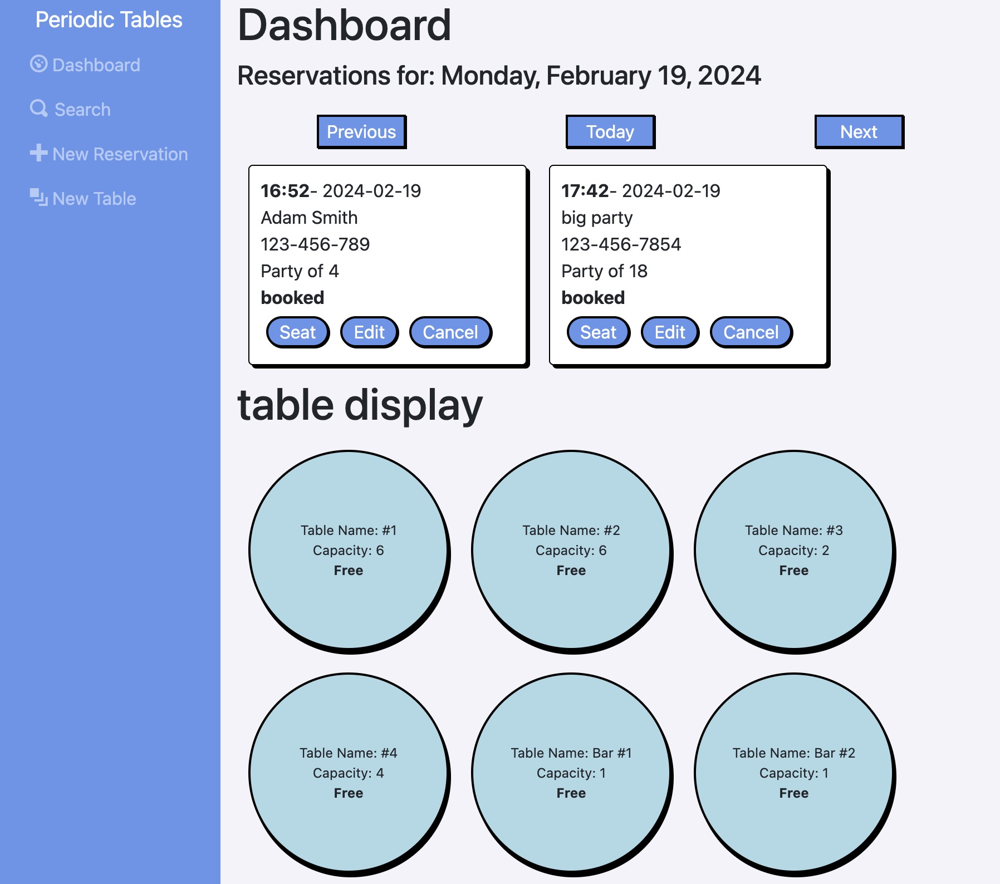
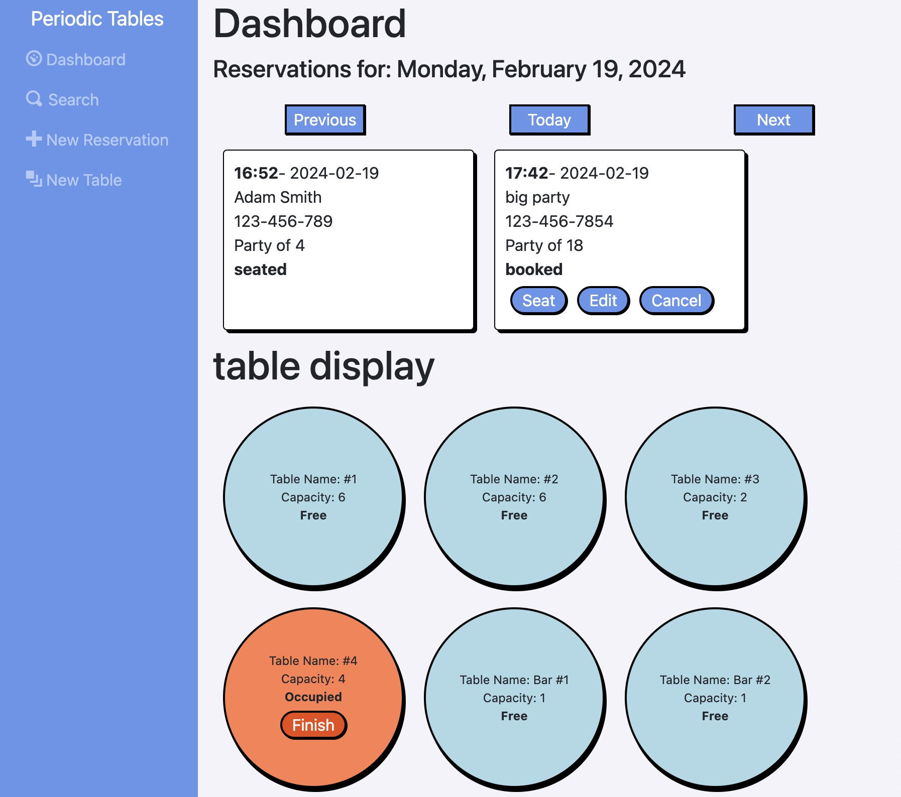
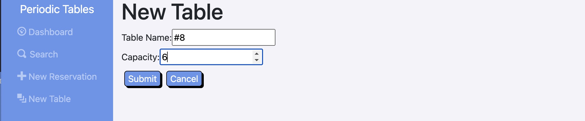

# Capstone: Restaurant Reservation System

This application, similar to OpenTable, allows restaurants to create and edit reservations as well as seat them in any configuration of tables. Parties can then be cleared and marked as finished. Also allows reservations to be searched by phone number. This is a fullstack application created as the capstone of a Software Engineer bootcamp.

Deployment:
https://restaurant-reservation-minezzi.vercel.app/

Backend:
https://restaurant-reservation-server-eight.vercel.app/





## My process

### Description
About this project


### Built with

Frontend:

- HTML
- CSS
- JavaScript
- React
- React Router
- React hooks (useState, useEffect)

Backend:

- Node.js
- Express
- PostgresSQL
- Knex
- Cors
- Dotenv

### Screenshots


## API

### Reservations

Each reservation contains the following fields:

- `reservation_id`: (Primary Key)
- `first_name`: (String) The first name of the customer
- `last_name`: (String) The last name of the customer
- `mobile_number`: (String) The customer's mobile
- `reservation_date`: (Date) The date of the reservation
- `reservation_time`: (Time) The time of the reservation
- `people`: (Integer) The size of the party
- `status`: (String) booked, seated, finished, or cancelled (default is booked)

```javaScript
  {
    "reservation_id": 314592654,
    "first_name": "Rick",
    "last_name": "Sanchez",
    "mobile_number": "202-555-0164",
    "reservation_date": "2020-12-31",
    "reservation_time": "20:00:00",
    "people": 6,
    "status": "booked"
  }
```

### Tables

Each table contains the following fields:

- `table_id`: (Primary Key)
- `table_name`: (String) The name of the table
- `capacity`: (Integer) Number of guests possible at table
- `reservation_id`: (Foreign Key) The reservation id of table currently sat (if any)

```javaScript
  {
    "table_name": "Table #1",
    "capacity": 6,
    "reservation_id": 31592654
  }
```

## Routes
API routes

Method | Route | Description
 -|-|-
| `GET` | `/reservations` | List all reservations for current date.
| `POST` | `/reservations` | Create a new reservation. No `reservation_id` or `status` should be provided. All other fields are required.
| `GET` | `/reservations?date=YYYY-MM-DD` | List all reservations on query date.
| `GET` | `/reservations/:reservation_id` | Read a specific reservation by `reservation_id`.
| `PUT` | `/reservations/:reservation_id` | Update a specific reservation by `reservation_id`.
| `PUT` | `/reservations/:reservation_id/status` | Update the status of a reservation.
| `GET` | `/tables` | List all tables.
| `POST` | `/tables` | Create new table. Only `table_name` and `capacity` should be provided.
| `PUT` | `/tables/:table_id/seat` | Assign a table to a reservation and change that reservation's `status` to _seated_. Body should contain only a `reservation_id`.
| `DELETE` | `/tables/:table_id/seat` | Removes a reservation from a table and changes reservation's `status` to _finished_
| `GET` | `/tables/free` | List all unoccupied tables.


## Installation Instructions

1. Fork and clone repository.
2. Run commands:
3. `cp ./back-end/.env.sample ./back-end/.env`
4. `cp ./front-end/.env.sample ./front-end/.env`
5. Edit `./back-end/.env` with URL to database.
6. Run `npm install` to install dependencies.
7. Run `npm run start:dev` to start in dev mode.
