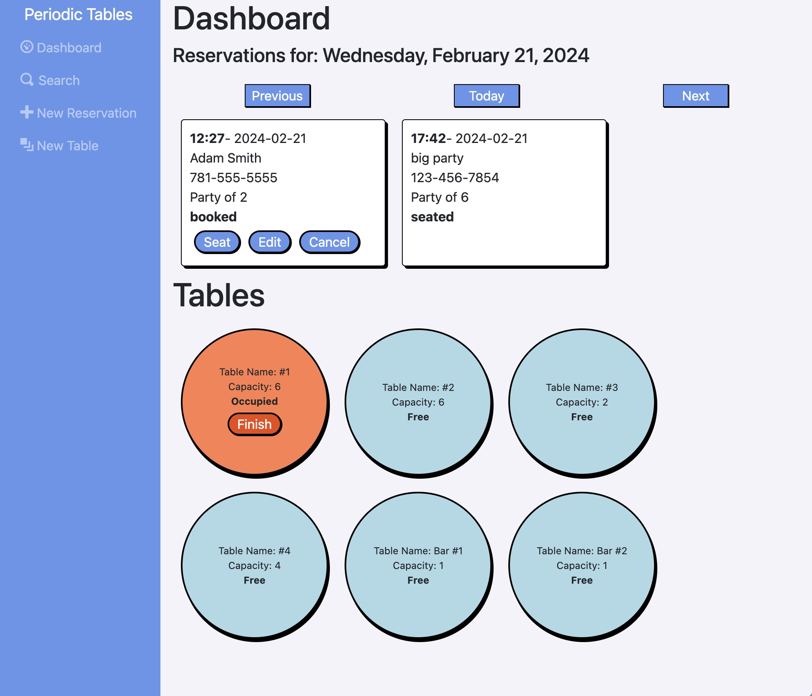

# Restaurant Reservation System

This application, similar to OpenTable, allows restaurants to create and edit reservations as well as seat them in any configuration of tables. Parties can then be cleared and marked as finished. Also allows reservations to be searched by phone number. This is a fullstack application created as the capstone of a Software Engineer bootcamp.



## Table of contents

- [Description](#description)
- [Links](#links)
- [Built With...](#built-with)
- [Feature Screenshots](#feature-screenshots)
- [API](#api)
  - [Routes](#routes)
  - [Reservations](#reservations)
  - [Tables](#tables)
- [Continued development](#continued-development)
- [Installation Instructions](#installation-instructions)

## Description

This is a fullstack project that was used as the capstone for a software engineering bootcamp. Prompt material can be viewed from original repo.

The target client for this application is a restaurant with dine-in guests. This application allows the client to keep track of both reservations prior to entering the restaurant as well as when they arrive and need to be seated in the dining room. When a reservation is made, all necessary information is recorded in the database and can be edited or deleted at a later time if required. Reservations can be viewed on a daily basis as well as searched by phone number.

The app also gives a view of all available tables in the dining room. Reservations can be digitally seated so it is easy to view availability. When a reservation is completed, the table is cleared and the reservation is archived.

In addition, new tables can also be created. At this time, however, they can not be edited or deleted.

## Links

Frontend:
https://restaurant-reservation-minezzi.vercel.app/

Backend:
https://restaurant-reservation-server-eight.vercel.app/

## Built with

Frontend:

- HTML
- CSS
- JavaScript
- React
- React Router
- React hooks (useState, useEffect)

Backend:

- Node.js
- Express
- PostgresSQL
- Knex
- Cors
- Dotenv

## Feature Screenshots

### Dashboard

The main dashboard of the app. The dashboard displays reservations for the selected day as well as all tables. Each reservation includes a "Seat", "Edit", and "Cancel" button along with its information. It also displays the status of any given table.  


### Create New Reservation

The Create a Reservation page allows the client to create a new reservation by including all necessary information.


### Edit Reservation

Edit the required information from a current reservation.


### Seat Reservation

Choose where to seat a reservation. Only the tables that have sufficient capacity will be available to choose from.


### Create New Table

Create a new table to add to the restaurant floor by providing necessary information.


### Search

Search for a reservation by phone number. Will also search partial numbers.


## API

### Routes

| Method   | Route                                  | Description                                                                                                                      |
| -------- | -------------------------------------- | -------------------------------------------------------------------------------------------------------------------------------- |
| `GET`    | `/reservations`                        | List all reservations for current date.                                                                                          |
| `POST`   | `/reservations`                        | Create a new reservation. No `reservation_id` or `status` should be provided. All other fields are required.                     |
| `GET`    | `/reservations?date=YYYY-MM-DD`        | List all reservations on query date.                                                                                             |
| `GET`    | `/reservations/:reservation_id`        | Read a specific reservation by `reservation_id`.                                                                                 |
| `PUT`    | `/reservations/:reservation_id`        | Update a specific reservation by `reservation_id`.                                                                               |
| `PUT`    | `/reservations/:reservation_id/status` | Update the status of a reservation.                                                                                              |
| `GET`    | `/tables`                              | List all tables.                                                                                                                 |
| `POST`   | `/tables`                              | Create new table. Only `table_name` and `capacity` should be provided.                                                           |
| `PUT`    | `/tables/:table_id/seat`               | Assign a table to a reservation and change that reservation's `status` to _seated_. Body should contain only a `reservation_id`. |
| `DELETE` | `/tables/:table_id/seat`               | Removes a reservation from a table and changes reservation's `status` to _finished_                                              |
| `GET`    | `/tables/free`                         | List all unoccupied tables.                                                                                                      |

### Reservations

Each reservation contains the following fields:

- `reservation_id`: (Primary Key)
- `first_name`: (String) The first name of the customer
- `last_name`: (String) The last name of the customer
- `mobile_number`: (String) The customer's mobile
- `reservation_date`: (Date) The date of the reservation
- `reservation_time`: (Time) The time of the reservation
- `people`: (Integer) The size of the party
- `status`: (String) booked, seated, finished, or cancelled (default is booked)

```javaScript
  {
    "reservation_id": 314592654,
    "first_name": "Rick",
    "last_name": "Sanchez",
    "mobile_number": "202-555-0164",
    "reservation_date": "2020-12-31",
    "reservation_time": "20:00:00",
    "people": 6,
    "status": "booked"
  }
```

### Tables

Each table contains the following fields:

- `table_id`: (Primary Key)
- `table_name`: (String) The name of the table
- `capacity`: (Integer) Number of guests possible at table
- `reservation_id`: (Foreign Key) The reservation id of table currently sat (if any)

```javaScript
  {
    "table_name": "Table #1",
    "capacity": 6,
    "reservation_id": 31592654
  }
```

## Installation Instructions

1. Fork and clone repository.
2. Run commands:
3. `cp ./back-end/.env.sample ./back-end/.env`
4. `cp ./front-end/.env.sample ./front-end/.env`
5. Edit `./back-end/.env` with URL to database.
6. Run `npm install` to install dependencies.
7. Run `npm run start:dev` to start in dev mode.
